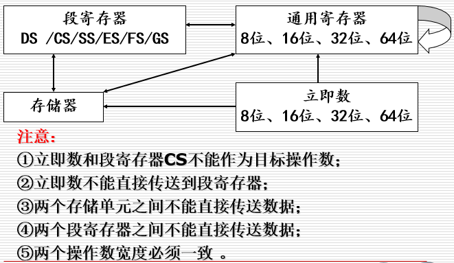
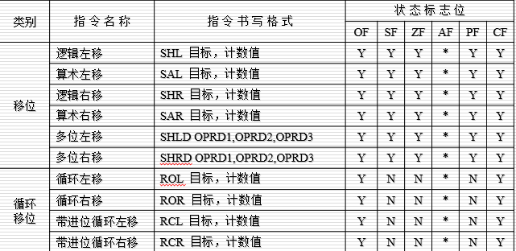
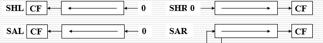
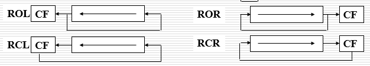

:runner::runner::runner: 

<!-- TOC -->

- [1. CPU 发展史 :star:](#1-cpu-发展史-star)
    - [1.1. 6](#11-6)
    - [1.2. 6](#12-6)
    - [1.3. 6](#13-6)
- [2. CPU内部寄存器](#2-cpu内部寄存器)
    - [2.1. 三类寄存器](#21-三类寄存器)
        - [2.1.1. 通用寄存器](#211-通用寄存器)
            - [2.1.1.1. 通用寄存器介绍](#2111-通用寄存器介绍)
        - [2.1.2. 控制寄存器](#212-控制寄存器)
            - [2.1.2.1. FLAG寄存器介绍](#2121-flag寄存器介绍)
        - [2.1.3. 段寄存器](#213-段寄存器)
- [3. 指令系统](#3-指令系统)
    - [3.1. 数据传送类指令](#31-数据传送类指令)
        - [3.1.1. 通用数据传送](#311-通用数据传送)
            - [3.1.1.1. MOV指令](#3111-mov指令)
            - [3.1.1.2. XCHG指令](#3112-xchg指令)
            - [3.1.1.3. XLAT 查表指令](#3113-xlat-查表指令)
        - [3.1.2. 堆栈操作指令](#312-堆栈操作指令)
            - [3.1.2.1. PUSH](#3121-push)
            - [3.1.2.2. POP](#3122-pop)
            - [3.1.2.3. 新增的PUSH/POP指令](#3123-新增的pushpop指令)
                - [3.1.2.3.1. 新增PUSHA/POPA](#31231-新增pushapopa)
                - [3.1.2.3.2. 新增PUSHAD/POPAD](#31232-新增pushadpopad)
        - [3.1.3. 地址传送指令](#313-地址传送指令)
            - [3.1.3.1. LEA 有效地址传送指令(Load Effective Address)](#3131-lea-有效地址传送指令load-effective-address)
            - [3.1.3.2. LDS/LES 地址指针传送指令](#3132-ldsles-地址指针传送指令)
        - [3.1.4. 标志位传送指令](#314-标志位传送指令)
            - [3.1.4.1. LAHF/SAHF 标志寄存器读写指令](#3141-lahfsahf-标志寄存器读写指令)
            - [3.1.4.2. PUSHF/POPF](#3142-pushfpopf)
        - [3.1.5. 输入/输出数据传送指令](#315-输入输出数据传送指令)
            - [3.1.5.1. IN/OUT 简单输入输出指令](#3151-inout-简单输入输出指令)
            - [3.1.5.2. INS/OUTS 字符串输入输出指令](#3152-insouts-字符串输入输出指令)
    - [3.2. 算术运算类](#32-算术运算类)
        - [3.2.1. 加减法类指令](#321-加减法类指令)
            - [3.2.1.1. ADD/SUB指令](#3211-addsub指令)
            - [3.2.1.2. ADC/SBB 进位、借位加减法指令](#3212-adcsbb-进位借位加减法指令)
            - [3.2.1.3. INC/DEC 增量、减量指令](#3213-incdec-增量减量指令)
            - [3.2.1.4. NEG 求补指令](#3214-neg-求补指令)
            - [3.2.1.5. CMP 比较指令](#3215-cmp-比较指令)
        - [3.2.2. 乘除法指令](#322-乘除法指令)
            - [3.2.2.1. MUL/IMUL 乘法指令](#3221-mulimul-乘法指令)
            - [3.2.2.2. DIV/IDIV 除法指令](#3222-dividiv-除法指令)
            - [3.2.2.3. CBW/CWDE/CDQE 符号扩展指令](#3223-cbwcwdecdqe-符号扩展指令)
            - [3.2.2.4. MOVSX/MOVZX 扩展传送指令](#3224-movsxmovzx-扩展传送指令)
            - [3.2.2.5. BCD 算术运算指令](#3225-bcd-算术运算指令)
    - [3.3. 逻辑运算与移位类](#33-逻辑运算与移位类)
        - [3.3.1. 逻辑运算](#331-逻辑运算)
            - [3.3.1.1. NOT](#3311-not)
            - [3.3.1.2. AND/OR/XOR](#3312-andorxor)
            - [3.3.1.3. TEST](#3313-test)
        - [3.3.2. 移位和循环指令](#332-移位和循环指令)
            - [3.3.2.1. SHL/SAL/SHR/SAR 移位指令](#3321-shlsalshrsar-移位指令)
            - [3.3.2.2. ROL/ROR/RCL/RCR 循环移位指令](#3322-rolrorrclrcr-循环移位指令)
    - [3.4. 串操作类](#34-串操作类)
        - [3.4.1. 重复前缀指令](#341-重复前缀指令)
            - [3.4.1.1. REP](#3411-rep)
            - [3.4.1.2. REPE/REPZ](#3412-reperepz)
            - [3.4.1.3. REPNE/REPNZ](#3413-repnerepnz)
        - [3.4.2. 基本串操作指令](#342-基本串操作指令)
            - [3.4.2.1. MOVS(MOVSB/MOVSW/MOVSD/MOVSQ)](#3421-movsmovsbmovswmovsdmovsq)
            - [3.4.2.2. CMPS(CMPSB/CMPSW/CMPSD/CMPSQ)](#3422-cmpscmpsbcmpswcmpsdcmpsq)
            - [3.4.2.3. SCAS(SCASB/SCASW/SCASD/SCASQ)](#3423-scasscasbscaswscasdscasq)
            - [3.4.2.4. STOS/LODS](#3424-stoslods)
    - [3.5. 控制转移类](#35-控制转移类)
        - [3.5.1. 无条件转移指令](#351-无条件转移指令)
            - [3.5.1.1. JMP](#3511-jmp)
        - [3.5.2. 条件转移指令](#352-条件转移指令)
            - [3.5.2.1. JC/JE/JZ/JO/JS](#3521-jcjejzjojs)
        - [3.5.3. 调用和返回指令](#353-调用和返回指令)
            - [3.5.3.1. CALL 调用指令](#3531-call-调用指令)
            - [3.5.3.2. RET 返回指令](#3532-ret-返回指令)
            - [3.5.3.3. LOOP 循环指令](#3533-loop-循环指令)
        - [3.5.4. 中断指令](#354-中断指令)
            - [3.5.4.1. INT](#3541-int)
            - [3.5.4.2. INTO](#3542-into)
            - [3.5.4.3. IRET](#3543-iret)
    - [3.6. 处理器控制](#36-处理器控制)
        - [3.6.1. 标志位操作指令](#361-标志位操作指令)
        - [3.6.2. 处理器协调指令](#362-处理器协调指令)
    - [3.7. 其他类](#37-其他类)
        - [3.7.1. BIOS & DOS 调用](#371-bios--dos-调用)

<!-- /TOC -->

# 1. CPU 发展史 :star:  
> 记得补一个Intel CPU的发展史 :alien:

## 1.1. 6

## 1.2. 6

## 1.3. 6

# 2. CPU内部寄存器  
对于汇编语言的编写，CPU中可以使用的资源也就是寄存器，可以用过指令读取寄存器的值。  
8086CPU内部总共有14个寄存器，均为16位。  
分为三类：通用寄存器、控制寄存器、段寄存器  

## 2.1. 三类寄存器  
---
### 2.1.1. 通用寄存器    

|数据寄存器|位数|功能|
|:---|:---:|:---|
|AX (Accumulator)|16|累加器|
|BX(Base)|16|基地址寄存器|
|CX(Count)|16|计数器寄存器|
|DX(Data)|16|数据寄存器|
|**指针寄存器**|位数|功能|
|SP(Stack Pointer)|16|堆栈指针寄存器|
|BP(Base Pointer)|16|基指针寄存器|
|**变址寄存器**|位数|功能|
|SI(Source Index)|16|源变址寄存器|
|DI(Destination Indes)|16|目的变址寄存器|  

----
#### 2.1.1.1. 通用寄存器介绍
由于在8086之前的CPU为8位CPU，所以为了兼容之前的8位程序  
在8086CPU中，每一个数据寄存器都可以当成两个8位的寄存器来使用。  
>只有4个数据寄存器可以分为两个8位的寄存器使用，其它寄存器不可以。  

|名称|高8位|低8位|
|:---:|:---:|:---:|
|AX|AH|AL|
|BX|BH|BL|
|CX|CH|CL|
|DX|DH|DL|

AX用于加减乘除指令。  
BX用于偏移地址取值。  
CX用于循环指令LOOP。  
DX配合AX指令计算用。  
BP存放偏移量，默认段是SS。  
SP默认段是？？？  

>8086CPU 中只有BX,SI,DI,BP可以以[x]的方式使用。

### 2.1.2. 控制寄存器

|控制寄存器|位数|功能|
|:---|:---:|:---|
|IP(Instruction Pointer)|16|指令指针寄存器|
|FLAG|16|标志寄存器|

---

#### 2.1.2.1. FLAG寄存器介绍 

|15|14|13|12|11|10|9|8|7|6|5|4|3|2|1|0|
|:---:|:---:|:---:|:---:|:---:|:---:|:---:|:---:|:---:|:---:|:---:|:---:|:---:|:---:|:---:|:---:|  
|  |  |  |  |OF|DF|IF|TF|SF|ZF| |AF| |PF| |CF|
|  |  |  |  |溢出标志|方向标志(控制SI,DI自增还是自减)|中断允许标志|追踪标志|符号标志(结果是否为负数)|零标志|  |辅助进位标志| |奇偶标志(记录运算结果的所有位中1的个数是否为偶数)| |进位标志|

|标志位名称|值为1时的标记|值为0时的标记|
|:---:|:---:|:---:|
|OF|OV|NV|
|SF|NG|PL|
|ZF|ZR|NZ|
|PF|PE|PO|
|CF|CY|NC|
|DF|DN|UP|

### 2.1.3. 段寄存器

|段寄存器|位数|功能|
|:---|:---:|:---|
|CS(Code Segment)|16|代码段寄存器|
|DS(Data Segment)|16|数据段寄存器|
|SS(Stack Segment)|16|堆栈寄存器|
|ES(Extra Segment)|16|附加段寄存器|

---
# 3. 指令系统
## 3.1. 数据传送类指令
### 3.1.1. 通用数据传送
#### 3.1.1.1. MOV指令
* 指令格式：MOV,DES,SUR
* 功能： 将源操作数传送给目标操作数

    MOV AL,BH ;通用寄存器之间传送字节数据  
    MOV DS,AX ;通用寄存器和段寄存器传送数据(**段寄存器不能是CS**)  
    MOV AX,1234H ;立即数传送到通用寄存器  
    MOV DX,BUFFER ;通用寄存器和内存传送数据  
       
#### 3.1.1.2. XCHG指令
* 指令格式：XCHG OPRD1,OPRD2
* 功能：将OPRD1和OPRD2交换
    MOV AX,1234H
    MOV BX,5678H
    XCHG AX,BX   ;通用寄存器之间交换数据
    XCHG AX,[100];寄存器和内存交换数据
> 两个操作数即使源操作数又是目的操作数，细节可以根据MOV的操作数要求。

#### 3.1.1.3. XLAT 查表指令
* 指令格式：XLAT
* 指令功能：完成一个字节的查表转换，将数据段中偏移地址为BX/EBX/RBX与AL寄存器之和的存储单元内容送到AL  即[BX+AL]->AL。 
    MOV BX,0100H ;  DS:0100H
    MOV AL,05H
    XLAT     ;DS:0105H的一个字节内容送到AL中

### 3.1.2. 堆栈操作指令
#### 3.1.2.1. PUSH  
* 指令格式：PUSH REG/MEM/IMM/SEG
* 指令功能：① SP-N->SP ② 源操作数圧入堆栈(N为操作数的字节数)

#### 3.1.2.2. POP
* 指令格式：POP REG/MEM/SEG
* 指令功能：① 从栈顶弹出操作数 ② SP+N->SP

> 8086中的栈是固定大小的，栈底在低端，栈顶的高端，压栈时从栈顶向栈底扩散。

#### 3.1.2.3. 新增的PUSH/POP指令
##### 3.1.2.3.1. 新增PUSHA/POPA
* 指令格式：PUSHA/POPA 
* 指令功能：将所有通用寄存器的内容圧入堆栈，顺序是：AX CX DX BX SP BP SI DI
POPA出栈顺序相反(弹出到SP的值被丢弃)。
##### 3.1.2.3.2. 新增PUSHAD/POPAD
* 指令格式：PUSHAD/POPAD
* 指令功能：将所有扩展通用寄存器的内容圧入堆栈，顺序是：EAX ECX EDX EBX ESP EBP ESI EDI
POPAD出栈顺序相反(弹出到ESP的值被丢弃).

### 3.1.3. 地址传送指令
#### 3.1.3.1. LEA 有效地址传送指令(Load Effective Address)
* 指令格式：LEA REG,MEM
* 指令功能：将源操作数在当前段内的有效地址(地址偏移量)传送到目标操作数。

    MOV DI,LISTS  ;变量LISTS的值传送给DI，DI=1234H
    LEA DX,LISTS  ;变量LISTS的偏移地址传送给DX
> MOV指令传送操作数的内容，LEA传送操作数的地址。

#### 3.1.3.2. LDS/LES 地址指针传送指令
* 指令格式：LDS REG,MEM  LES REG,MEM
* 指令功能：都是将由源操作数偏移地址决定的双字（或三字）单元中的第一个（或前两个）字的内容送入指令指定的16位（或32位）通用寄存器，第二个（或第三个）字的内容传送给段寄存器DS或ES，这两个段寄存器是隐含的目的操作数。

    TAB1 DF 123456789ABCH ;定义TAB1为6字节数据
    TAB2 DD 56781234H      ;定义TAB2为4字节数据
    LDS BX,TAB1           ;9ABCH->BX,5678->DS
    LES SI,TAB2           ;1234H->SI,5678H->ES
> 只适用于16位或者32位地址模式，在64位地址下不能使用

### 3.1.4. 标志位传送指令
#### 3.1.4.1. LAHF/SAHF 标志寄存器读写指令
* 指令格式：LAHF/SAHF 
* 指令功能：LAHF将标志寄存器低字节读出后传送到AH寄存器，SAHF与LAHF相反。

#### 3.1.4.2. PUSHF/POPF
* 指令格式：PUSHF/POPF
* 指令功能：将FLAG寄存器(2个字节)压到栈顶/弹出栈顶

### 3.1.5. 输入/输出数据传送指令
#### 3.1.5.1. IN/OUT 简单输入输出指令
* 指令格式：IN AL/AX,IMM8/DX  OUT IMM8/DX,AL/AX
* 指令功能：专门用于在AL或AX寄存器与I/O端口之间传送数据
    IN AX,30H   ;从端口30H输入16位数到AX
    MOV DX,300H
    IN AL,DX
    OUT 60H,AL
    OUT DX,AX  ;向300H端口输出16位数据

#### 3.1.5.2. INS/OUTS 字符串输入输出指令
* 指令格式：INSB/INSW/INSD/OUTSB/OUTSW/OUTSD
* 指令功能：从(向)DX指定的端口输入(输出)一个字节/字/双字到ES:DI指定的内存单元。

>该指令因为用到DI寄存器，所以要DF标志位配合，若DF=0，则DI自增；DF=1,DI自减。

>IN或者OUT是相对于CPU来讲的，IN就是外部到CPU，OUT就是CPU到外部。

## 3.2. 算术运算类
*此类指令的执行会影响标志寄存器FLAG*
### 3.2.1. 加减法类指令
#### 3.2.1.1. ADD/SUB指令
* 指令格式：ADD(SUB) reg/mem,reg/mem/imm
* 指令功能：ADD完成两个操作数的加法运算，结果送到第一个操作数；SUB完成第一个操作数减去第二个操作数，结果送到第一个操作数。
    MOV AX,65A0H
    MOV BX,B79EH
    ADD BX,AX
    执行完之后，BX=1D3EH CF=1,SF=0,AF=0,ZF=0
> ADD/SUB指令的第一个操作数不能为立即数，因为其要存储结果，作为目的操作数。

#### 3.2.1.2. ADC/SBB 进位、借位加减法指令
* 指令格式：ADC(SBB) OPRD1,OPRD2
* 指令功能：常用于长度为两个字或者两个字以上的操作数的运算，加法操作时在最低位加上进位位CF，减法操作数减去借位位CF。
    MOV AX,1234H
    ADD AL,78H
    ADC AH,56H
    实现1234H+5678H,分两次计算，分别为低位和高位。

#### 3.2.1.3. INC/DEC 增量、减量指令
* 指令格式：INC(DEC) MEM/REG
* 指令功能：是单操作数指令，完成对指定的操作数加1或者减1，然后返回此操作数。
    INC CX ;CX寄存器内容加1
    DEC WORD PTR[EAX] ;把EAX指向的字存储单元内容减1
> 指令的执行影响AF、OF、PF、SF、ZF,但是不影响CF

#### 3.2.1.4. NEG 求补指令
* 指令格式：NEG REG/MEM
* 指令功能：用零减去操作数，再把结果送回操作数，结果是对操作数取负。

> 影响所有的状态标志位。

#### 3.2.1.5. CMP 比较指令
* 指令格式：CMP OPRD1,OPRD2
* 指令功能：计算OPRD1-OPRD2的结果，执行完成之后不改变操作数，仅仅影响标志位。
    讨论
    * 如果是两个无符号数比较，可以根据CF来判断：
        * CF=1, OPRD1 < OPRD2
        * CF=0, OPRD1 > OPRD2
    * 如果是两个有符号数比较，要根据SF和OF来判断：
        * SF⊕OF=0, OPRD1 > OPRD2
        * SF⊕OF=1, OPRD1 < OPRD2
    * 若ZF=1，不管有无符号，两个操作数相等。

### 3.2.2. 乘除法指令
#### 3.2.2.1. MUL/IMUL 乘法指令
* 指令格式：MUL(IMUL) REG/MEM
* 指令功能：分别用于无符号数的乘法和有符号数的乘法运算。只有一个源操作数，目的操作数隐含在AX中。
    格式：
    * AL*SRC(8b)->AX(16b)  ;source data is 8bit,result store in ax
    * AX*SRC(16b)->DX:AX(32b) ;source data is 16b,result store in ds&ax
#### 3.2.2.2. DIV/IDIV 除法指令
* 指令格式：DIV(IDIV) REG/MEM
* 指令功能：分别用于无符号和有符号数的除法运算。只有一个源操作数，目的操作数隐含在AX中。
    格式：
    * SRC:8bit  AX/SRC->AH(余数):AL(商)
    * SRC:16bit DX:AX/SRC->DX(余数):AX(商)

> 对于IMUL和IDIV指令允许多操作数使用，结果存放在第一个操作数指定的寄存器中。

    IMUL BX,CX  ;BX*CX->BX
    IMUL AX,[BX+DI],1234H  ;1234H*DS:[BX+DI]->AX

#### 3.2.2.3. CBW/CWDE/CDQE 符号扩展指令
* 指令格式：CBW(CWDE/CDQE)
* 指令功能：操作数隐藏在AX中。
    * CBW将AL中有符号数的符号扩展到AX中。
        * AL < 80H ,AH->0
        * AL > 80H ,AH->0FFH
    * CWED将AX中有符号数的符号扩展到EAX中。
    * CDQE将EAX中有符号数的符号扩展到RAX中。

> 该指令不影响标志位寄存器。

#### 3.2.2.4. MOVSX/MOVZX 扩展传送指令
* 指令格式：MOVSX(MOVZX) REGDes , REGSrc
* 指令功能：将源操作数进行有符号(无符号)扩展后放入目的寄存器
    MOVZX EAX,CX; 将CX中16位数零扩展为32位后送入EAX
    MOVSX RCX,AL; 将AL中8位数有符号扩展64位后送入RCX

> MOVSX(Signal)  MOVZX(Zero)

#### 3.2.2.5. BCD 算术运算指令

## 3.3. 逻辑运算与移位类

### 3.3.1. 逻辑运算  
**总览** 

|指令名称|指令书写格式|OF|SF|ZF|AF|PF|CF|
|:---|:---|:---:|:---:|:---:|:---:|:---:|:---:|
|非|NOT DES|N|N|N|N|N|N|
|与|AND DES,SRC|0|Y|Y|*|Y|0|
|或|OR DES,SRC|0|Y|Y|*|Y|0|
|异或|XOR DES,SRC|0|Y|Y|*|Y|0|
|测试|TEST DES,SRC|0|Y|Y|*|Y|0|

#### 3.3.1.1. NOT
* 指令格式：NOT reg/mem
* 指令功能：将操作数按位取反后送回
    MOV EAX,66668888H
    NOT EAX ;执行完了之后EAX=99997777H

#### 3.3.1.2. AND/OR/XOR
* 指令格式：AND/OR/XOR reg/mem,reg/imm/mem
* 指令功能：执行按位逻辑“与”“或”和“异或”操作(两个操作数宽度必须相等) 执行结果存入第一个操作数中。
    AND AL,OFH ;AL的高四位被屏蔽，第四位被取出
    OR BX,0003H;BX的第0位和第一位置为1
    XOR AX,AX;  将AX置为0，同时改变FLAG寄存器的值(MOV AX,0 不改变FLAG寄存器的值)

#### 3.3.1.3. TEST
* 指令格式：TEST reg/mem,reg/mem/imm
* 指令功能：与`AND`指令相同，但操作结果不送回目标操作数，即两个操作数不变，只影响标志位。
    TEST AL,01H
    JNZ EXIT; 检测AL寄存器第0位是否为1，为1则跳转

### 3.3.2. 移位和循环指令

#### 3.3.2.1. SHL/SAL/SHR/SAR 移位指令
* 指令格式：SHL/SAL/SHR/SAR reg/mem,1/CL/imm8
* 指令功能：指令影响PF、SF、ZF、CF以及OF五个标志位，对AF的影响不确定。  CF：总是等于目标操作数最后移出的那一位。
    

> SH* 代表逻辑移动 即零扩展，SA* 代表算术移动，即符扩展

#### 3.3.2.2. ROL/ROR/RCL/RCR 循环移位指令
* 指令格式：ROL/ROR/RCL/RCR reg/mem,1/CL/imm8
* 指令功能：实现循环移动

> 两种移位指令，若移动的单位大于1时，必须放在寄存器里面。

## 3.4. 串操作类
*1.约定以DS:SI寻址原串，以ES:DI寻址目标串*   
*2.用方向标志(DF)规定串处理方向*  
*3.重复前缀时，CX作为重复计数器*  

### 3.4.1. 重复前缀指令
*不能单独使用，只能加在串操作指令之前，用来控制其后指令是否重复*
#### 3.4.1.1. REP
* 指令格式：REP 串操作指令
* 指令功能：重复串操作指令，当CX=0时停止(CX自动减1)

#### 3.4.1.2. REPE/REPZ
* 指令格式：REPE(REPZ) 串操作指令
* 指令功能：重复串操作指令，当CX=0或者ZF=0时退出。

#### 3.4.1.3. REPNE/REPNZ
* 指令格式：REPNE(REPNZ) 串操作指令
* 指令功能：重复串操作指令，当CX=0或者ZF=1时退出。

### 3.4.2. 基本串操作指令
*根据DF寄存器的值选择操作方向，DF=0,DI/SI++;DF=1,DI/SI--;*
#### 3.4.2.1. MOVS(MOVSB/MOVSW/MOVSD/MOVSQ)
* 指令格式：MOVS DST,SRC 或者单用(MOVSW(字节)、MOVSW(字)、MOVSD(双字)、MOVSQ(四字))
* 指令功能：把DS：SI指定的源串中的一个字节或字，传送至由ES：DI指定的目标串。且根据方向标志DF自动地修改SI、DI，以指向串中的下一个元素。
    LEA	SI，SOURCE
    LEA	DI，DEST
    MOV	CX，50		;设置循环操作次数
    CLD				;设置方向标志DF＝0
    REP	MOVSW       ;每次移动一个字，重复50次

#### 3.4.2.2. CMPS(CMPSB/CMPSW/CMPSD/CMPSQ)
* 指令格式：CMPS OPRD1,OPRD2或者单用(CMPSB/CMPSW/CMPSD/CMPSQ)
* 指令功能：将DS：SI指定的源串中的元素减去由ES：DI指定的目标串中的相应元素，但两个存储单元中的内容不变，而是用标志位的变化表示比较结果，同时根据方向标志DF自动修改源和目标串指针SI、DI。

    CLD              ;DF=0,增量方向
    LEA  SI,DS:SRC   ;字符串首地址送DS:SI
    LEA  DI,ES:DST   ;目标地址送ES:DI
    MOV  CX,N        ;字符串长度
    REPNE  CMPSB     ;重复比较字符串
　  JNZ  NOT_FOUND   ;无相同的元素,转NOT_FOUND,否则继续执行下条指令

#### 3.4.2.3. SCAS(SCASB/SCASW/SCASD/SCASQ)
* 指令格式：SCAS OPRD (或者单用SCASB/SCASW/SCASD/SCASQ)
* 指令功能：将累加器AL或AX中的内容与ES：DI指定的目标串元素（字节或字或双字或4字）进行比较（减法操作），用标志位反映比较的结果，而不改变累加器和目标串的内容，达到字符串搜索的目的，同时自动修改指针DI。
    例：在首地址为ES:DST的字符串中检查是否有字符'M',字符串的长度为N个字节。
        CLD              　;DF=0,增量方向
        LEA  DI,ES:DST     ;目标地址送ES:DI
        MOV  CX,N        　;字符串长度
        MOV  AL,‘M’        ;搜索字符送AL
        REPNE  SCASB       ;重复搜索字符串是否有字符'M'
#### 3.4.2.4. STOS/LODS 
* 指令格式：STOS/LDOS ORPD (或者单用STOSB/LODSB/STOSW/LODSW/STOSD/LODSD/STOSQ/LODSQ)
* 指令功能：
    * `STOS`将累加器(AL或AX)的内容存入由`ES：DI`指定的目标串中去，同时自动修改DI。指令前可加重复前缀REP，以给一个内存块赋同一个值。
    * `LODS`将`DS：SI`指定的源串中的元素，传送到AL(字节操作)或AX(字操作)寄存器中，同时自动修改SI。

    例：将首地址为DS:SRC的32位数据串中值为87654321H的元素送到首地址为ES:DST的内存区中。字符串长度为1000H字节。
            CLD                 　　;DF=0,增量方向
            LEA  ESI,SRC        　　;字符串首地址送DS:SI
            LEA  EDI,ES:DST     　　;目标地址送ES:DI
            MOV  ECX,400H       　　;字符串长度1000H/4=400H
    CONTINUE: LODSD               　;取字符串的一个元素
            CMP  EAX, 87654321H     ;字符串元素为87654321H吗?
            JNE  NEXT          　　  ;不是,继续取下一个元素
            STOSD        　          ;是,存入首地址为ES:DST的内存区中
    NEXT: DEC  ECX
            JNZ  CONTINUE

## 3.5. 控制转移类

### 3.5.1. 无条件转移指令
#### 3.5.1.1. JMP
* 指令格式：JMP 目标标号
* 指令功能：CPU指令执行无条件转移到目标标号的指令处。
    JMP指令有以下5种形式：
    1. 段内直接短转移：JMP　SHORT lable  
　　   功能：无条件地转移到lable所指定的目标地址。短（SHORT）转移时，目标地址与JMP指令的下一条指令地址之差在-128～127字节之间，即跳转地址的偏移范围为8位带符号二进制数范围，属于相对转移。  
    2. 段内直接近转移：JMP　NEAR PTR lable
　　   功能：无条件转移到目标地址lable。跳转地址的偏移范围为16位带符号二进制数的范围，即±32K，属于相对转移。
    3. 段内间接转移：JMP  reg 或 JMP 	mem
　　   功能：无条件转移到由寄存器的内容指定的目标地址，或由寄存器间接寻址、基址变址、相对基址变址提供的存储单元内容所指定的目标地址，是一种绝对转移指令。
    4. 段间直接转移：JMP	FAR PTR lable
       功能：无条件转移到指定段内的目标地址lable，是绝对转移指令。
    5. 段间间接转移：JMP  mem
       功能：程序将转向由mem指定的双字指针中第一个字单元的内容作为IP，第二个字单元的内容作为CS的目标地址。

### 3.5.2. 条件转移指令
#### 3.5.2.1. JC/JE/JZ/JO/JS
|指令格式|指令功能|
|JE/JZ LABLE|ZF=1时跳转到LABLE|
|JNE/JNZ LABLE|ZF=0时跳转到LABEL|
|JC LABLE|CF=1时(有进位/借位)跳转|
|JNC LABLE|CF=0(无进位/借位)跳转|
|JO LABLE|OF=1 溢出转移|
|JNO LABLE|OF=0 无溢出转移|
|JP/JPE LABLE|PF=1 偶数个1转移|
|JNP/JPO LABLE|PF=0 奇数个1转移|
|JS LABLE|SF=1 负数转移|
|JNS LABLE|SF=0 正数转移|

### 3.5.3. 调用和返回指令
#### 3.5.3.1. CALL 调用指令
* 指令格式：CALL OPRD
* 指令功能：调用子程序(过程)OPRD , 和JMP相似。

> 调用前要先PUSH操作，保护当前的CS和IP。

#### 3.5.3.2. RET 返回指令
* 指令格式：RET (或者 RET IMM16)
* 指令功能：返回到调用这个子程序的断点处，作为子程序或过程的最后一条指令。
    * 若是段内返回，则把栈顶的一个字弹出至IP，恢复调用时断点处的偏移地址；
    * 若为段间返回，则除了弹出IP外，还要从当前栈顶继续弹出一个字到CS，恢复断点处的段地址。

> RET IMM16 : RET指令在完成返回操作后，还须作SP←SP+imm16，即删除栈中imm16个字节的内容。

#### 3.5.3.3. LOOP 循环指令
* 指令格式：LOOP(LOOPE/LOOPZ/LOOPNE/LOOPNZ) LABLE
* 指令功能：循环执行程序。
    * LOOP ：CX!=0 跳转到LBALE执行
    * LOOPZ/LOOPE : CX!=0 && ZF=1 才跳转到LABLE执行
    * LOOPNZ/LOOPNE : CX!=0 && ZF=0 才跳转LABLE执行

> 注意：循环指令在执行前，自动使CX-1.

### 3.5.4. 中断指令

|指令名称|指令助记符|
|:---|:---|
|中断|INT 中断类型号|
|溢出时中断|INTO|
|中断返回|IRET|

#### 3.5.4.1. INT
* 指令格式：INT imm8 
* 指令功能：用于产生一个由8位立即数指定中断号的内部中断。该指令首先将标志寄存器FLAG和断点地址（CS和IP）进栈，并将标志位TF和IF清零，然后转向指定中断号的中断服务程序。系统中最多可用256条这样的中断指令。

#### 3.5.4.2. INTO
* 指令格式：INTO
* 指令功能：内部中断指令INT的特例，中断号隐含为4。它只有当某运算结果使OF置1时
才产生中断。

#### 3.5.4.3. IRET
* 指令格式：IRET
* 指令功能：从堆栈中弹出原进栈保护的IP、CS和标志寄存器FLAG值，继续被中断程序的执行。

> 所有的中断过程，最后一条指令必须是IRET，用于退出中断过程，返回到中断时的断点。

## 3.6. 处理器控制

### 3.6.1. 标志位操作指令

|指令名称|操作标志位|功能|
|:---|:---|:---|
|STC|CF|进位标志置1|
|CLC|CF|进位标志复位|
|CMC|CF|进位标志取反|
|STD|DF|方向标志置1|
|CLD|DF|方向标志复位|
|STI|IF|中断标志置1|
|CLI|IF|中断标志复位|

### 3.6.2. 处理器协调指令

|指令名称|功能|
|:---|:---:|
|HLT|停机|
|WAIT|等待|
|LOCK|封锁总线|
|NOP|空操作|

## 3.7. 其他类
*以后再补*

### 3.7.1. BIOS & DOS 调用
* 格式： INT n
* 功能： 调用n对应的功能  

其中 n = 21H 是最为强大的 DOS 中断。一般调用中断须先将参数放入指定寄存器，功能号放入 AH，子功能号放入 AL。

|功能号(AH)|功能|参数|
|:---:|:---:|:---:|
|01H|输入一个字符|AL=输入字符的ASCII码|
|0AH|输入一个字符串|DS:DX=缓冲区首地址|
|02H|显示一个字符|AL=显示字符的ASCII码|
|09H|显示一个字符串|DS:DX=字符串首地址|

    MOV AH,09H
    MOV DX,string
    INT 21H

