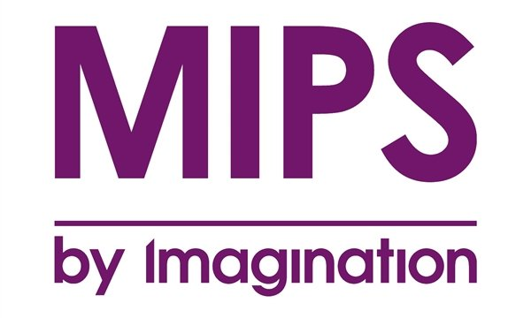

# 汇编语言
**写在前面**:smirk:  
大二下学期学习计算机组成原理的时候拿`MIPS`汇编语言介绍的，大三上的微机原理介绍的是`80x86`类的汇编语言，感觉两者还是有点差距的，因此想要系统的学习一下这两种汇编语言。  
这里只是简单的学习，以后用得多的话，再深入研究...  

MIPS属于精简指令集，其所有的指令都是32位固定的。  
而80x86汇编语言的指令长度是不固定的。  
简单的指令格式易于译码和流水线操作，但是代码的密度不高，导致二进制文件很大。 

R型指令  

|op|rs|rt|rd|sha|func|
|:---:|:---:|:---:|:---:|:---:|:---:|
|6|5|5|5|5|6| 

I型指令  

|op|rs|rt|imm16|
|:---:|:---:|:---:|:---:|
|6|5|5|16|

J 型指令  

|op|addr26|
|:---:|:---:|
|6|26|
